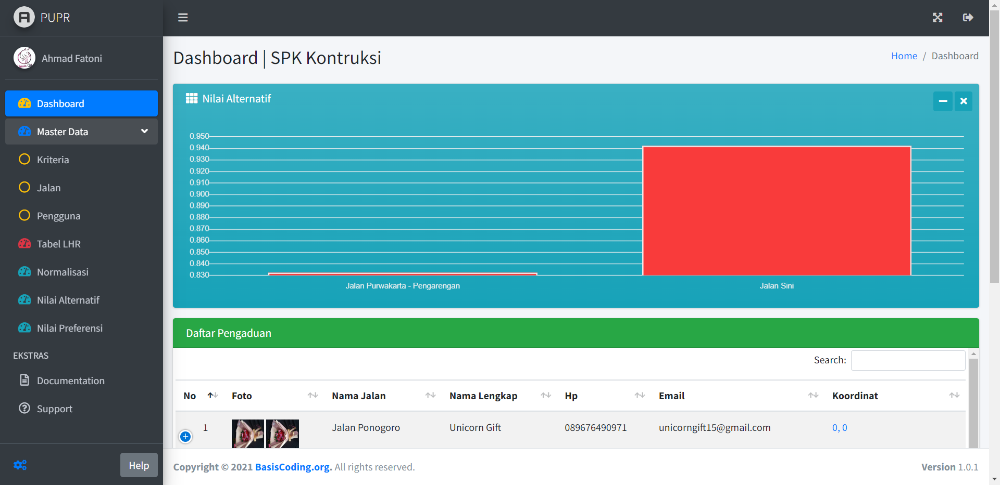
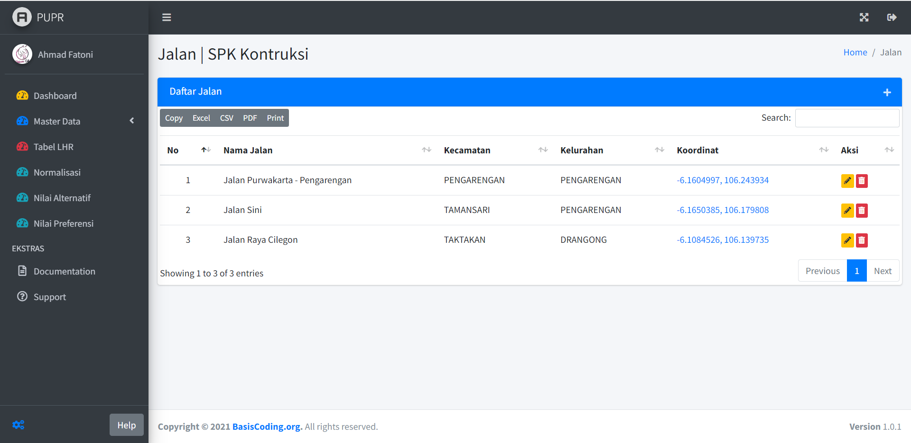
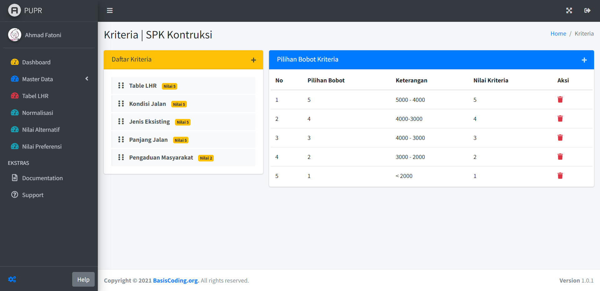
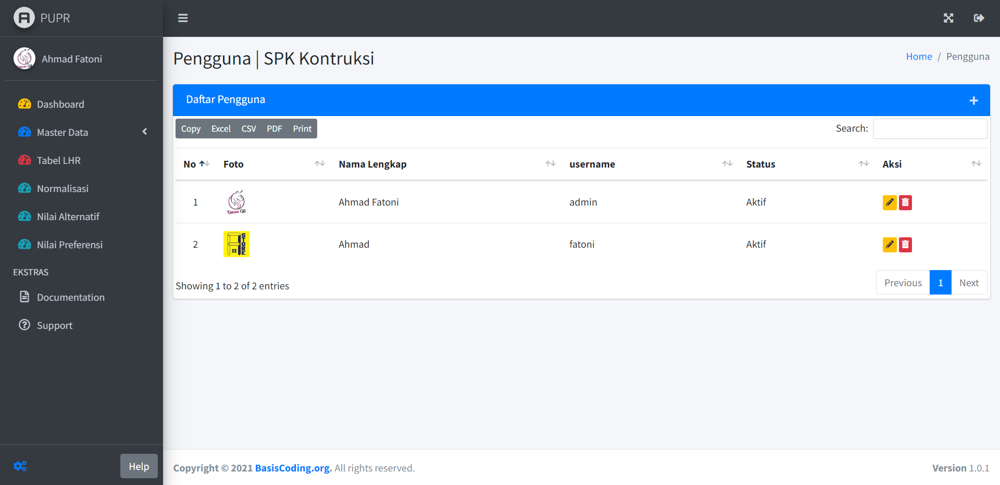
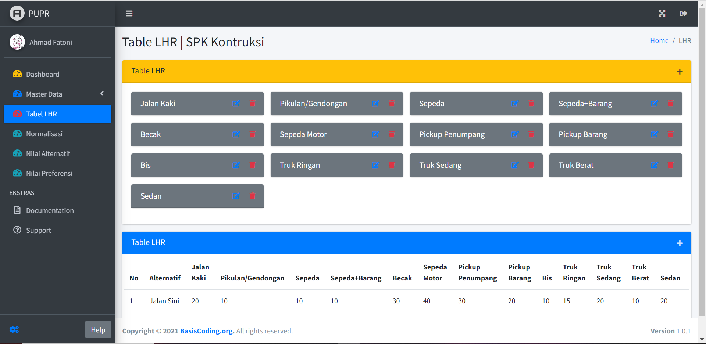
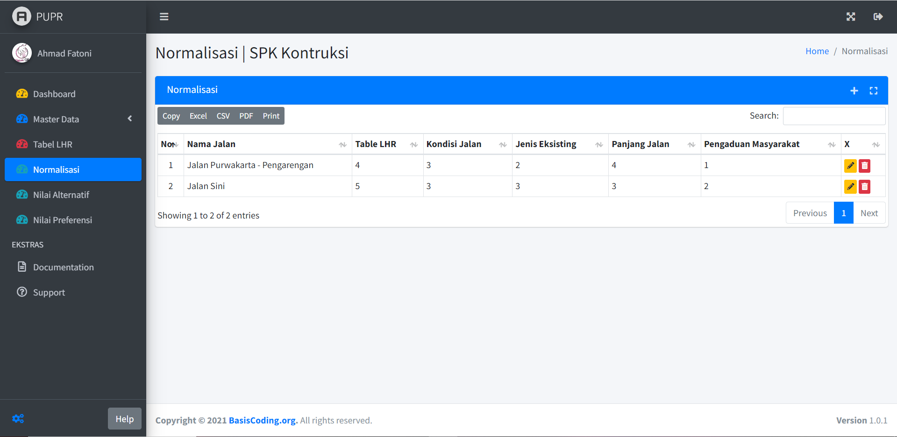
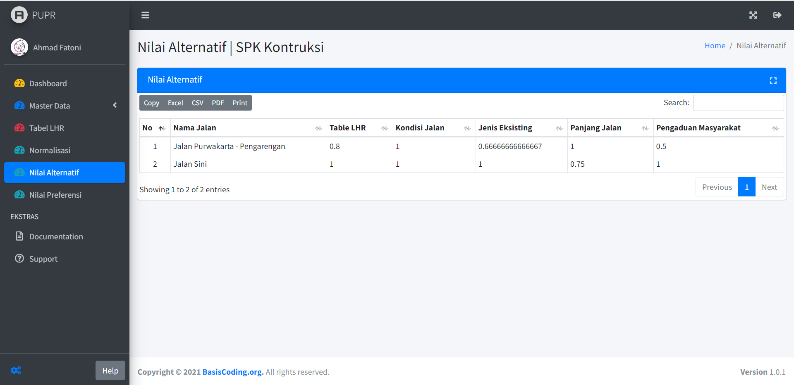
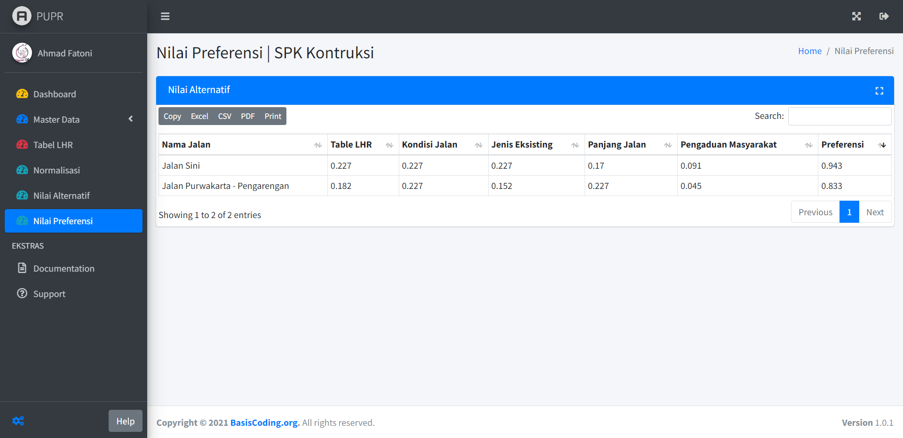

# Aplikasi Sistem Pendukung Keputusan Konstruksi Jalan (SPK-Konstruksi-Jalan)

Aplikasi ini bertujuan untuk mendukung pengambilan keputusan dalam menentukan konstruksi jalan mana yang akan diprioritaskan. Dengan menggunakan metode Sistem Pendukung Keputusan (SPK), aplikasi ini membantu menganalisis dan memberikan rekomendasi berdasarkan kriteria tertentu.

## Fitur

1. **Dashboard**: Ringkasan visual dari statistik dan informasi penting.
2. **Master Data Jalan**: Manajemen data mengenai jalan yang akan dibangun.
3. **Master Data Kriteria**: Pengelolaan kriteria yang digunakan untuk evaluasi.
4. **Master Data User**: Manajemen pengguna aplikasi.
5. **Table LHR**: Tabel hasil penilaian kriteria.
6. **Normalisasi**: Proses normalisasi nilai kriteria.
7. **Nilai Alternatif**: Penilaian alternatif berdasarkan kriteria.
8. **Nilai Preferensi**: Penentuan nilai preferensi untuk setiap alternatif.

## Screenshot

### 1. Dashboard

### 2. Master Data Jalan

### 3. Master Data Kriteria

### 4. Master Data User

### 5. Table LHR

### 6. Normalisasi

### 7. Nilai Alternatif

### 8. Nilai Preferensi

## Instalasi

1. Clone repositori ini: `git clone https://github.com/inotechno/spk-konstruksi-jalan.git`
2. Impor struktur database dari `puprtesis.sql`.
3. Konfigurasi file `application/config/database.php` untuk pengaturan koneksi database.

## Kontribusi

Proyek ini terbuka terhadap kontribusi. Jika Anda tertarik untuk berkontribusi atau melaporkan masalah, silakan buka issue atau pull request. Kontribusi Anda sangat dihargai.

## Lisensi

Diberikan di bawah lisensi MIT - Lihat [LICENSE](LICENSE) untuk lebih lanjut.
